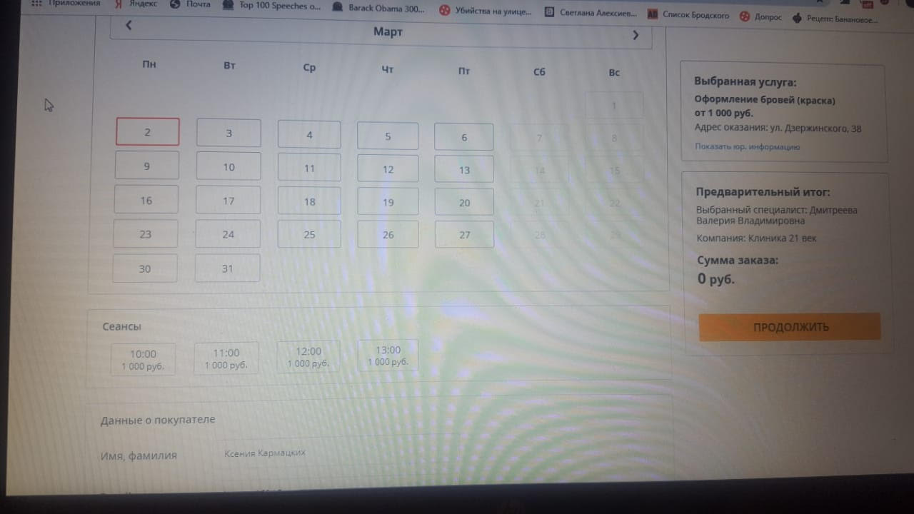

## Welcome to Designing Meaningful Interactions by Katherine Dillon

### Final Presentation and Prototype


### User flow sign up, login, and onboarding..


### The main user-experience however starts with Day's interface.


### The Vaccines and Milestones interface would borrow from this visualization


### The calendar choices would look something like


### The old yellow card is being replaced by an Interactive Data Visualization that may look like


Source: https://pudding.cool/2019/12/real-mvp/


Source: https://pudding.cool/2020/01/apology/


You can view [Week 4 presentation](https://docs.google.com/presentation/d/1d0VlyH_sJjfWlDtPem4eYXyoOKvPOLYIcXUFmmIPWgE/edit?usp=sharing) to see the problem we are trying to solve and the future state journey map!


The persona is a college educated, 30-35 year old, Natalie, living in the city in a married household with a combined $150K income. Her goals include establishing herself in the city and raising a family. Her motivation is to track her baby's health she is responsible for,and have something to keep a record of her baby's health. Her frustrations are that communication styles are incomplete and the use of yellow card is fruitless. Current behavior entails anxiousness and insecurity in an uncharterd territory. Future Behavior could include more transparent communicationn with the pediatrician, acces to messages,i.e. if in an app one can plug in data from the baby, and the app can tell height/weight percentile (not having to manually compute height/weight percentile). Also rather than looking into CDC schedule online, if the app can tell which medicial visit and vaccination is coming up, and which side effects should you be looking out for (example Benadryl has allergies), expectations can be planned! 

<div style="width: 960px; height: 720px; margin: 10px; position: relative;"><iframe allowfullscreen frameborder="0" style="width:960px; height:720px" src="https://www.lucidchart.com/documents/embeddedchart/0c71de23-71a6-41f7-945e-6614a8a51a0b" id="OG7wMhvW_Dvr"></iframe></div>

Feeiings that call for intervention vary from anxiousness and insecurity of parenting a child for the first time, to harassment due to sleeplessness and constant need of caring for a baby, something nobody else would do for you. Parents feel a sort of inadequacy when they're unable to monitor and plan around their childs health.

<div style="width: 960px; height: 720px; margin: 10px; position: relative;"><iframe allowfullscreen frameborder="0" style="width:960px; height:720px" src="https://www.lucidchart.com/documents/embeddedchart/86138730-5a45-4248-97e5-290b9dff342f" id="cF7wV2W6cnN_"></iframe></div>


<a href="https://ibb.co/4RWRjD2"></a>

### Pain points:

- Forgetfulness - Reminder notification to help parents remember the upcoming doctor visit is not there.

- Skipping work  - To help parents prepare & plan for half-day off, or take a complete day off depending on vaccine  related symptoms there should be a calendar for upcoming vistations.

- Communication issue - Doctor may not be able to convey what the parents must understand. Maximum growth of brain occurs during the first year of life. The baby learns to sit and walk and talk. Milestones are achieved and extra care is required during the first year. Parents may have unanswered questions in this fast paced context

- Waiting time is long - the practice is often crowded with parents and their children and the doctor is too busy. 

- Consultation time is limited - time that doctor provides for examination and Q/A is not adequate and does not satisfy the parents. 

- Questionnaire  that parents share at the end of the visit  is not shareable with the doctor before the visit. 

- Yellow Card does not mention the timeline of  upcoming events, it just mentions retrospective information. Parents cannot plan their next visit using the Yellow Card

- Yellow Card is a manual record keeping system that parents may forget to bring along or lose. There is no detailed medical history accessible to parents that they can take back home with them. 

- Yellow Card has complex graphs on it that parents have to plot on manually and they do not fully understand the concept of percentiles that the graph plots. 

You may also view the presentation here: [Week 2 assignment](https://docs.google.com/presentation/d/1rmCEI9mxrBIwhK_9jC0UuLdtaj3pPm7GnEphu9-QTo4/edit?usp=sharing), additional work may be viewed here: [Draft](https://docs.google.com/presentation/d/1PdGTNkk3kwJqzzhY7qmCddiQNnnOptJWOikt1MQV4B0/edit#slide=id.g6ecccd1907_0_165)


You can view [Week 1 assignment](https://docs.google.com/presentation/d/1vgpuJA4gBx7ddJbG7qAa_ueDPiDff4OaIl3Gv5FYZaU/edit#slide=id.p) to get an overview of the issue we discussed in class. 

During the next six weeks we will study:

1. What is UX
2. Discover - a problem
3. Define - ideation, applying it to a problem
4. Design UX
5. Design UI - visual layer on the top, color, typogoraphy, white space usage 
6. Develop and Test - user testing


### 5 characteristics of good UX:
```markdown
Intuitive - without instructional manual
Efficient - worth pepoles time,
Memorable
Anticipates errors
Satisfying - so people want to come back
```

#### A lot of ux designers call themselves product designers.
#### Product shouldn’t come with a manual with instructions it should be intuitive. 
#### Focus on the user and all else will follow 
#### Desirable experience = good business 

```markdown
**Research and _ideation_***
```
[WHO Report](www.timesvr.com) 


